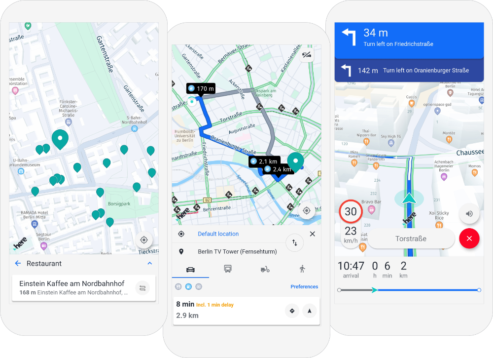

# HERE SDK Reference Application for Flutter

The reference application for the [HERE SDK for Flutter (_Navigate Edition_)](https://developer.here.com/documentation/flutter-sdk-navigate/) shows how a complex and release-ready project targeting iOS and Android devices may look like. You can use it as a source of inspiration for your own HERE SDK based projects - in parts or as a whole.

## Overview

With this blueprint reference application you can see how UX flows can be built for the HERE SDK - covering the main use cases from searching for POIs, planning and picking a route and finally starting the trip to your destination.

- Learn how the [HERE SDK 4.x](https://developer.here.com/products/here-sdk) can be complemented with rich UI for your own application development.
- Discover how to avoid common pitfalls, master edge cases and benefit from optimized end user flows.
- All code using the HERE SDK is implemented in pure Dart following well-established clean code standards.
- On top, the reference application is enriched with tailored graphical assets - adapted for various screen sizes and ready to be used in your own projects.

If you are looking for smaller bits & pieces or just want to get started with the integration of the HERE SDK into a simpler project, you may want to start looking into our [example apps](https://github.com/heremaps/here-sdk-examples/tree/master/examples/latest/navigate/flutter) selection including a stripped down [hello_map_app](https://github.com/heremaps/here-sdk-examples/tree/master/examples/latest/navigate/flutter/hello_map_app) that accompanies the [Developer's Guide](https://developer.here.com/documentation/flutter-sdk-navigate/) for the HERE SDK.

The reference application hosted in this repo focuses on how specific features can be implemented and used within the context of a full blown Flutter application - not only to show the usage of our APIs and the HERE SDK functionality as clear and understandable as possible, but also to show how complex Flutter projects in general can be organized and developed with production quality.

### Supported features (so far):

- [Search](https://developer.here.com/documentation/flutter-sdk-navigate/api_reference/search/search-library.html): Including suggestions, text search and search along a route corridor.
- [Routing](https://developer.here.com/documentation/flutter-sdk-navigate/api_reference/routing/routing-library.html): As of now, the reference application supports the following transport modes: car, truck, scooter and pedestrian.
- [Turn-By-Turn Navigation](https://developer.here.com/documentation/flutter-sdk-navigate/api_reference/navigation/navigation-library.html): Including maneuver instructions with visual feedback and voice guidance.

## Get Started

The reference application for the HERE SDK for Flutter (_Navigate Edition_) requires the following prerequisites:

-  The [HERE SDK for Flutter (_Navigate Edition_), version 4.9.0.0](https://developer.here.com/documentation/flutter-sdk-navigate/4.9.0.0/dev_guide/index.html) is required and needs to be downloaded from the [HERE platform](https://platform.here.com). For now, the _Navigate Edition_ is only available upon request. Please [contact us](https://developer.here.com/help#how-can-we-help-you) to receive access including a set of evaluation credentials.
- If not already done, install the [Flutter SDK](https://flutter.dev/docs/get-started/install). We use [version 2.8.0](https://flutter.dev/docs/development/tools/sdk/releases). Newer versions may also work, but are _not guaranteed_ to work.
- Make sure to specify `JAVA_HOME` in your `env` variables. The minimum supported JDK version is Java 8.

On top you need an IDE of your choice. This could be a text editor or IDEs such as [Visual Studio Code](https://code.visualstudio.com/) with the [Flutter extension](https://marketplace.visualstudio.com/items?itemName=Dart-Code.flutter) or [Android Studio](https://developer.android.com/studio). We use Android Studio 4.1.3 for development.

Note: If you want to compile, build & run for iOS devices, you also need to have [Xcode](https://developer.apple.com/xcode/) and [CocoaPods](https://cocoapods.org/) (version 1.10.0 or higher) installed. We use Xcode 12.4 for development. If you only target Android devices, Xcode is _not_ required.

### Add the HERE SDK Plugin

Make sure you have cloned this repository and you have downloaded the HERE SDK for Flutter (_Navigate Edition_), see above.

1. Unzip the downloaded HERE SDK for Flutter _package_. This folder contains various files including various documentation assets.
2. Inside the unzipped package you will find a TAR file that contains the HERE SDK _plugin_.
3. Unzip the TAR file and rename the folder to 'here_sdk'. Move it inside the [plugins](./plugins/) folder.

### Build the Reference Application

1. Set your HERE SDK credentials: The reference application does not require hardcoded credentials for the `AndroidManifest` or `Plist` file. Instead the credentials are read from your local environment. Therefore, you need to add two _system environment_ variables, `HERESDK_ACCESS_KEY_ID` and `HERESDK_ACCESS_KEY_SECRET`. For example, from a MacOS terminal execute:

    -  `export HERESDK_ACCESS_KEY_ID="YOUR_ACCESS_KEY_ID"`
    -  `export HERESDK_ACCESS_KEY_SECRET="YOUR_ACCESS_KEY_SECRET"`

    You may need to restart the terminal application to take effect.

    Note that for iOS builds an extra step is needed: Execute the bash script [setup_ios_here_sdk_keys.sh](./ios/setup_ios_here_sdk_keys.sh) with `setup_ios_here_sdk_keys.sh` from within the `iOS` folder of this repository. As a result, a new file should be created under `ios/Flutter/GeneratedKeys.xcconfig` which will contain your credentials.

2. Go to the repository root folder which contains the `pubspec.yaml` and run the terminal command `flutter pub get` to fetch the required dependencies.

3. Open the project in your IDE of choice and execute the Flutter project for your target platform.

#### How to build Flutter apps for Android and iOS

If you are new to Flutter, here are more detailed steps for you. You may also want to consult the official [Flutter](https://flutter.dev) site in general and the [Flutter SDK](https://flutter.dev/docs/development/tools/sdk/overview) documentation in particular first.

- Build for Android:
  - Build an Android APK by executing `flutter build apk` or use the command `flutter run` to build and run on an attached device.
- Build for iOS:
  - Run `pod install` in the [ios folder](./ios/).
  - Then go back to the repository root folder and type `flutter build ios` to build a Runner.app. Type `flutter run` to build and run on an attached device.
  - You can open the `/repository root/ios/Runner.xcworkspace` project in Xcode and execute and debug from there.
  - Note: You need to have valid _development certificates_ available to sign the app for device deployment.

## Contributing

You can contribute to this open source project and improve it for others. There are many ways to contribute to this project, whether you want to create an issue, submit bug reports or improve the documentation - we are happy to see your merge requests. Have a look at our [contribution guide](./CONTRIBUTING.md) and [code of conduct](./CODE_OF_CONDUCT.md). Happy coding!

## Questions and Support

We provide the code 'AS IS'. Using the source code does not come with any additional grant of customer support or promise of specific feature development on our part. If you have any questions, please [contact us](https://developer.here.com/help#how-can-we-help-you) or check the tag `here-api` on [stackoverflow.com](https://stackoverflow.com/questions/tagged/here-api).

## License

Copyright (C) 2020-2021 HERE Europe B.V.

See the [LICENSE](./LICENSE) file in the root folder of this project for license details.

For other use cases not listed in the license terms, please [contact us](https://developer.here.com/help).

### Note

This application and the HERE SDK itself include open source components which require explicit attribution. Please remember to add open source notices in your project.
Furthermore, we ask you not to re-sell the icons included in this project.
